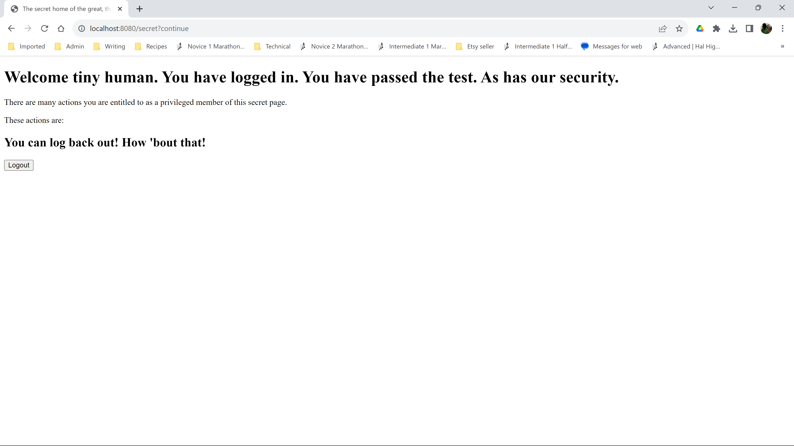

# oauth
Minimal custom OAuth2 provider example to show spring OAuth2 connecting to WordPress plugin - WP OAuth2 server

<h1>Purpose of project</h1>
Basic OAuth2 custom provider example to show spring OAuth2 authentication using this custom provider (a WordPress OAuth2 plugin).
This project uses Spring boot 3.2.0, Spring security 6 and OAuth2 with OAuth2 provider <a href="https://wp-oauth.com/">WordPress OAuth2 plugin.</a>

The free version of the plugin supports only the 'authorization code' OAuth2 flow. This project implements that flow. The version of the plugin this works with is 4.3.3. It may work with earlier / later versions but there are no guarantees in life and once you accept that, you will be happier.

<h1>How the project demonstrates OAuth2 authentication</h1>
When the app is started, it serves on <a href="http://localhost:8080/home">http://localhost:8080/home</a>

com.ddt.auth.MVCConfig maps to the error.html, index.html and secret.html to /error, /home and /secret respectively. It also maps "/logged_out" to index.html so when the user logs off, they will be taken back to the 'home page' where they can log on again if they want to.

com.ddt.oauth.configuration.OAuth2SecurityConfig makes /home, "/index.html", /error, "/error.html" and /logged_out publicly accessible while securing "/secret" (secret.html) using Spring Security (which in turn uses OAuth2). 

<h1>Building the app</h1>
<h2>To build and run this app, you will need:</h2>

1. Enough knowledge of git / github to download the project code from this repo.
2. The URL of your WordPress website (the one where you've installed the WP OAuth2 server plugin).
3. To have installed and configured the WordPress OAuth2 plugin on your WordPress site.
4. To have set the redirect_uri on your WordPress OAuth2 plugin client settings to http://localhost:8080/login/oauth2/code/your_custom_client_provider_label
4. The client ID and client secret values from your OAuth2 plugin client settings page (see application.properties setup below).
3. Enough understanding of the OAuth2 'authorization code' authentication flow to set up your application.yaml / application.properties correctly.
3. These development tools (it may work with other versions and IDEs, but I haven't tested it, you're on your own if you deviate):
   1. JAVA JDK 17.0.6
   2. Maven 3.8.2
   3. IntelliJ IDEA v 2023.2.5 (Community Edition)
   4. git >=2.42.1
4. Ideally, to be a JAVA dev who understands these instructions well enough to infer what's going on without any further explanation than what's been provided here.

<h2>To build, run and test:</h2>
1. Copy the repo to your system (for example by downloading it to your computer). 
2. Unpack (UNZIP) the code and move the resulting oauth-master folder to your preferred IDE location e.g. on Windows C:\Users\you\src\Intellij\ or Linux: /home/you/local/src/IntelliJ/ 
3. (I could be wrong but I think you need to do this for maven to work properly out of the box) Rename the oauth-master folder to oauth (e.g. 
   cd C:\Users\you\src\Intellij\
   move oauth-master oauth)
4. Open your IDE and open the oauth project.
5. I have .gitignore'd my real application properties to protect sensitive authentication data. The values I have provided here are correct in that they reflect the same endpoint mappings used by the WordPress plugin but I've changed the site URL. I have also, needless to say given fake random values for the sensitive data rather than the real ones. With this in mind, create an application.properties (or application.yaml, whichever you normally use) file in src\main\resources. The application.properties version needs to look something like this:

      spring.security.oauth2.client.registration.<i>your_custom_client_provider_label.provider</i>.clientID=01234abcdefveryimportantsecretid111222333 
      spring.security.oauth2.client.registration.<i>your_custom_client_provider_label.provider</i>.clientSecret=abcdefghijklman9998888veryimportantsecretsecret1111   
      spring.security.oauth2.client.registration.<i>your_custom_client_provider_label.provider</i>.authorization-grant-type=authorization_code
      spring.security.oauth2.client.registration.<i>your_custom_client_provider_label.provider</i>.client-name=<i>YOUR_CUSTOM_OAUTH2_CLIENT_NAME</i>   
      spring.security.oauth2.client.registration.<i>your_custom_client_provider_label</i>.redirect-uri=http://localhost:8080/login/oauth2/code/your_custom_client_provider_label
      spring.security.oauth2.client.registration.<i>your_custom_client_provider_label</i>.provider.userNameAttributeName=user_nicename
      spring.security.oauth2.client.registration.<i>your_custom_client_provider_label</i>.provider=<i>your_custom_client_provider_label</i>
      spring.security.oauth2.client.provider.<i>your_custom_client_provider_label</i>.provider.authorization-uri=https://your.wordpress.site.com/oauth/authorize   
      spring.security.oauth2.client.provider.your_custom_client_provider_label.token-uri=https://your.wordpress.site.com/oauth/token
      spring.security.oauth2.client.provider.your_custom_client_provider_label.user-info-uri=https://your.wordpress.site.com/oauth/me
      # These are custom fields (also see code). 
      oauth2.provider-logout-endpoint=https://your.wordpress.site.com/oauth/destroy?post_logout_redirect_uri=http://localhost:8080/logged_out
      oauth2.logout-success-url=http://localhost:8080/logged_out  
      oauth2.login-page=/oauth2/authorize/your_custom_client_provider_label

If you are using application.yaml, you can guess the contents from the above. The tabs do my head in. :-)

6. You can use the build menu in IntelliJ e.g. Build->Build Project / Rebuild project. Or you open a terminal in the IDE and mvn spring-boot:run which will build it then run the OAuth2Application main class.
7. Assuming the app starts up (check terminal or run window for exceptions), in your browser, go to http://localhost:8080. You should see this:
. 
8. Click the mysterious 'this link to try a login' link, and it should take you to your WordPress site's login page (I'm not showing you mine because it's private and I have good boundaries). Log in using your user credentials and if you've logged in successfully, you should see the amazing secret page:
  
9. Click the logout button and it should take you back to the 'home' page. 
10. Test whether it's really logged you out by manually entering the URL http://localhost:8080/secret.html. It should take you back to the home page. If it takes you back to the amazing secret page, something has gone badly wrong and you should be afraid (you know how afraid).

<h3>Optional properties</h3>
If you're interested in seeing what's going on during the OAuth2 authentication process, you can crank up the logging level using the following additional properties:

        logging.level.org.springframework.security=TRACE
        logging.level.org.springframework.security.oauth2=TRACE
        logging.level.org.springframework.web=TRACE
        logging.level.com.ddt.oauth.configuration=TRACE
        spring.mvc.log-request-details=true

<h3>Note on property values</h3>
1. Look at the property values carefully, how you need to change them should be reasonably self documenting. They assume you're running the spring boot app on your computer (localhost:8080). The values will <b>NOT</b> work out of the box. You need to put in your own WordPress site URL, your own client ID and client secret. In most cases, it should be a case of replacing the hostname parts of the URLs with your own WordPress site hostname and the provider registration name you have set up in your WordPress OAuth2 plugin.

2. If you use spring-mvc.log-request-details=true, remember to change it to false or remove it (it's false is the default setting so deleting it will set it back to false) when you deploy to your live server. It exposes sensitive information the logs. Strictly for dev purposes!

<h1>Peculiarities of the project</h1>
This project started out as a bug report to spring security. The state parameter value in redirection to the OAuth2 provider endpoint is base64 and some part of the Spring OAuth2 logic pads it with an '=' (which gets encoded to %3D). 

I couldn't get the project I was originally working on to successfully handle authentication because the WordPress plugin strips the %3D when it calls back to the Spring Boot application. The state parameter value (among other things) is used by Spring OAuth2 to look up the original request so that call was always failing because ("abcdef%3D".equals("abcdef") == false (or more to the point, != true!). So I created this minimal project to submit the support request / bug report.  

I used debugging to discover the problem was happening and logged a JIRA bug report on the Spring Security issue tracker page. They provided me with some workaround code which you can see in the src/main/java/com/ddt/configuration/OAuth2SecurityConfig.java. That provides a custom generator for the state value which generates a Hex encoded randomly generated state parameter value instead of a base64 encoded one. That gets around the OAuth2 provider's bug. But it creates another problem. For some reason, plugging the new authorizationRequestResolver to the security config causes it to stop finding the correct login callback URL. 

So that's what these are for:
<b>OAuth2SEcurityConfig.java:</b>
@Value("${oauth2.login-page}")
private String oauth2LoginPage;

<b>application.properties</b>
oauth2.login-page=/oauth2/authorize/your_custom_client_provider_label

it's a hack I'm afraid. There should be a way of plugging in the custom key generator without upsetting the OAuth2 defaults and I'll amend the code and this README if and when I work it out.

The end. Happy OAuth2 authenticating.
